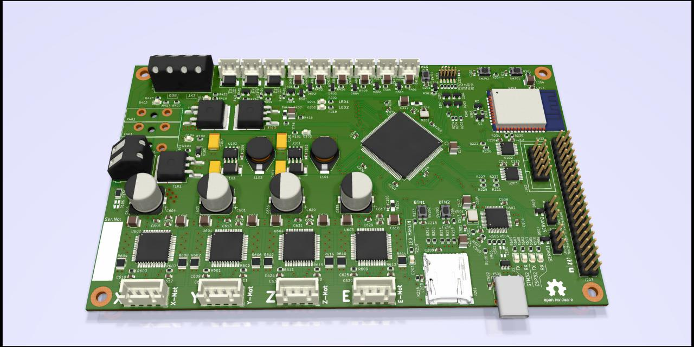

# FHNW-Pro4E-FS19T8-3DPrinterBoard-STM32

Marlin 2.0 compatible 3D printer board based on STM32F103

---

(just kidding, this hardware project is still in development)

FHNW School of Engineering

Elektro- und Informationstechnik (EIT)

FS 2019 - Projekt 4 - Team 8

#### Abstract

> This paper documents the development of a mainboard and adaptation of an open source firmware for a common hobbyist 3D printer. The innovative aspect of this hardware development is the usage of a 32-bit microcontroller as well as adding a web interface for remote access. Part of the research included finding out if high-end stepper motor drivers, which detect a motor stall, could be used to implement a sensorless homing. A Creality Ender 3 Pro provided the mechanical elements of the printer hardware. The mainboard is built around an STM32f103 microcontroller with an ARM Cortex M3 core. TMC2660 drivers were used to drive the motors of the three axes (X, Y, Z) as well as the extruder. Furthermore, Wi-Fi compatibility was added through the usage of an ESP32-Wroom module on the mainboard. By using a 32-bit architecture for the main processor, we had to use the development branch of the Marlin firmware 2.0. Web compatibility was achieved by running the ESP3D firmware on the ESP32. Through the web interface, every feature of the 3D printer can be controlled, and the marlin firmware can be upgraded. We could prove, that the stall detection feature of the TMC2660 motor driver ICs allow the reduction of end-stop sensors to zero. While this feature reduces the umber of wires that need to be routed around the printer’s frame, it still requires the same number of I/O pins. In this project we proved that the Marlin 2.0 firmware is in a stable state and we recommend using 32-bit Microcontrollers for newly developed 3D printer hardware. 

#### Keywords
> 3D printer firmware, Wi-Fi web interface, sensorless homing, 

---

## Specifications

### Microcontroller

`stm32 stm32F103ZEt6`

---

## Software

Marlin 2.0 Software is in a separate Repository.

[MuellerDominik / Marlin](https://github.com/MuellerDominik/Marlin)

---

## License

GNU GPLv3

