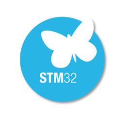

# FHNW-Pro4E-FS19T8-3DPrinterBoard-STM32

Marlin 2.0 compatible 3D printer board based on STM32F103

---

[](https://github.com/auchenberg/volkswagen)

(just kidding, this hardware project is still in development)

FHNW School of Engineering

Elektro- und Informationstechnik (EIT)

FS 2019 - Projekt 4 - Team 8

---

## Specifications

### Microcontroller



`stm32 stm32F103ZEt6`

---

## Software

Marlin 2.0 Software is in a separate Repository.

---

### Interrupt Pins

```
PF0   E3_END_FIL
PF1   SW_END_X
PF2   SW_END_Y
PE3   ENCODER_BTN
PE4   SW_END_Filament_1
PE5   SW_END_Z
PG6   STALL_E1
PA7   STALL_X
PB8   ENCODER_A
PB9   ENCODER_B
PD10  BUTTON_1
PG11  E2_STALL
PG12  E3_STALL
PD13  STALL_Z1
PG14  E2_END_FIL
PF15  STALL_Y
```

---

## License

GNU GPLv3


